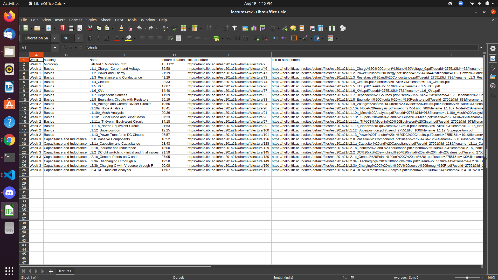

# SAHIL BANSAL
# Submission for Pclub secretary recruitment
# Task-4 Mookit Scrapping

## Approach-
All the code for this task is in **scraper.ipynb** notebook

I was completely new to this topic but found it easy especially with various libraries of python so learned it and completed it.

I first Tried to do it with **regular expressions**, learned how to use them but could not do it because of large number of nested **div** tags, so I went for libraries instead.

I used **selenium** library to login to mookit using username and password which user gives as input. Then after login i could get hold of the source code of the page the user is interested in.

Then I used **BeautyfullSoup** library to scrape this source code. I manually looked for tags which are of intereste to me and then extracted them using this library.

Then I converted the data to **pandas** dataframe and save last 'n' (given by user) entries of it to the csv file.

#### This is all what I have extracted-
<ul>
<li> Week of lecture</li>
<li> Name of lecture </li>
<li> Duration of lecture </li>
<li> Link to lecture </li>
<li> Link to the attachments provided (if any) </li>
</ul>

## Results-
The results are saved in lectures.csv
The below screenshot shows the results-
